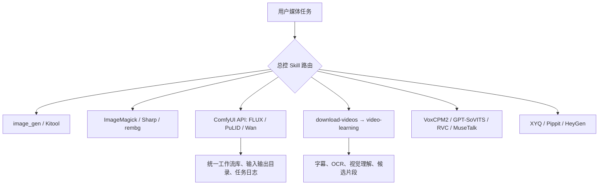

# Codex Local Media Studio

本仓库记录这台 Windows 工作站截至 **2026-08-02** 的图片、视频、音频、视频理解能力，以及它们的调用边界、实际路径、容量和待修复项。它是未来“媒体总控 Skill / Media MCP”的事实基线；不包含模型、用户素材、Cookie、Token 或 API Key。

## 先看结论

| 领域 | 可直接使用 | 当前限制 |
| --- | --- | --- |
| 常规生图/生成式改图 | Codex `image_gen`；用户明确要求 CLI 时可走 Kitool GPT-Image-2 | Kitool 属云 API，需已配置的 Key 和额度 |
| 本地可复现生图 | FLUX.1-dev、Redux、Fill 文件齐全 | 8188 API 当前只识别到部分 UNET/CLIP；Checkpoint、ControlNet、PuLID 下拉为空 |
| 确定性修图 | ImageMagick；Node 项目内用 Sharp | 生成式修改不应走这两者 |
| 本地抠图 | CUDA rembg + `u2net_human_seg`（人物） | `isnet-general-use.onnx` 缺失，非人物物体抠图未补齐 |
| 本地图生视频 | Wan 2.2 I2V 模型文件在盘 | 需要修通 ComfyUI 模型路径、保存 Canvas/API 工作流并 smoke test |
| 视频下载/理解/筛片 | 受授权下载、FFmpeg、Whisper、OCR、Qwen-VL、InsightFace、Insta360 SDK 工作流 | 翻译与双语字幕尚未形成验收过的自动化链路 |
| 本地配音/换声/对口型 | VoxCPM2、GPT-SoVITS、RVC、MuseTalk 环境均在 | RVC/GPT-SoVITS 没有已训练的角色专属权重 |
| 云端图/视频/短剧 | Kitool、XYQ/Pippit、小云雀、HeyGen 连接器 | Key、额度、模型选择与云端结果均需每次按入口核验 |

详细能力与调用方式见 [docs/local-media-inventory.md](docs/local-media-inventory.md)，容量和凭据状态见 [docs/storage-and-credentials.md](docs/storage-and-credentials.md)。

## 调用总线

未来应建设一个“总控大 Skill”，只负责任务分类、健康检查、统一路径、任务记录和验收；保留现有专用 Skill/CLI/API 作为执行器。把所有实现细节硬塞进一个超长 `SKILL.md` 会造成重复规则和难以维护的分支。

## 本次完成与后续

1. 已完成：ComfyUI API 共享模型、输入与输出路径修复；FLUX 固定 seed 冒烟图通过。
2. 已完成：VIDEO_LEARNING_ROOT 已统一为 D:\CodexVideoLearning，并已通过运行时自检。
3. 已完成：isnet-general-use.onnx 已下载、校验并用 CUDA Provider 验证。
4. 已完成：Wan 1.3B 已从官方 ComfyUI 仓库重新下载、SHA-256 校验并被 API 发现。
5. 后续：收到用户授权的人物图、关键帧、视频或录音后，按验证与验收记录建立相应 Canvas/API 工作流并做生产验收。

需要素材的验收项目及交付标准见 docs/validation-and-acceptance.md。

## 安全与仓库边界

- 本仓库公开，但只存文档、工作流模板和无敏感测试样例。
- API Key、Token、Cookie、`.env`、用户素材、模型、缓存、输出和训练权重均不得提交。
- 云端视频提交前必须先编写或更新项目内《视频生成任务上下文提交包.md》；只有入口能显式选择或可靠约束用户指定模型时才提交。
- 人脸、声音、视频和下载内容必须具有用户本人或明确授权；不绕过 DRM、付费、登录、地区或反自动化限制。

## 文档目录

- [本机媒体能力清单](docs/local-media-inventory.md)：Skill、软件、模型、节点、服务、SDK、调用链路与验收状态。
- [存储与凭据状态](docs/storage-and-credentials.md)：实测容量、模型尺寸、程序路径、环境变量与安全配置位置。
- [验证与验收记录](docs/validation-and-acceptance.md)：已完成的机器验证，以及等待用户素材的生产验收清单。
